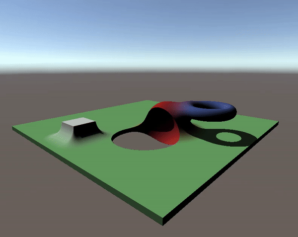

# **Ray Marching in Unity [Discontinued]**

Detailed explanation [here](https://dev.to/javiersalcedopuyo/ray-marching-in-unity-2kno)  
I re-implemented and continued exploring ray marching at [ShaderToy](https://www.shadertoy.com/view/3lsSWr)  

